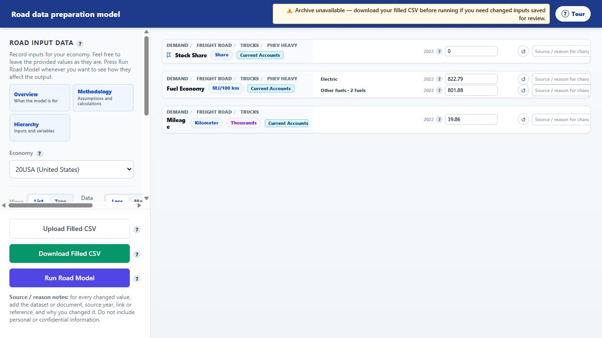
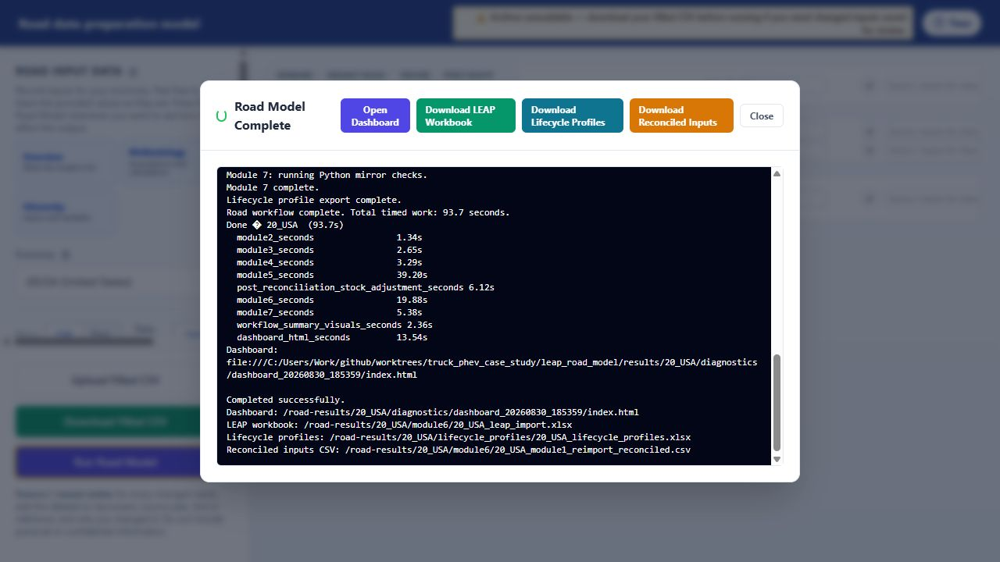
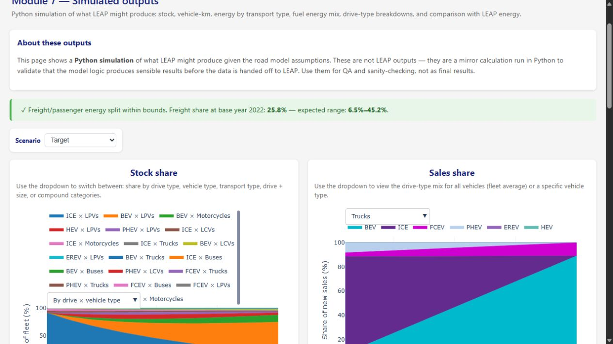
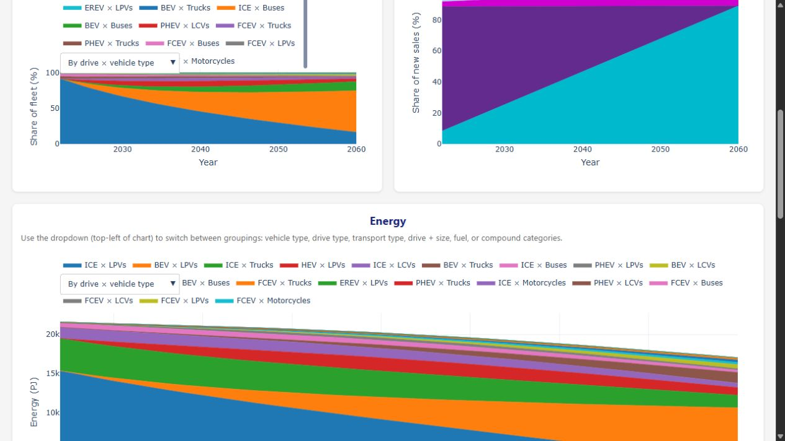
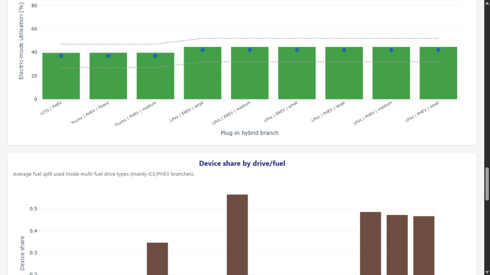

# Adding a road drive type: truck PHEV case study

## Outcome

This case study verifies that the road-model pipeline can add an existing drive
type to a new vehicle type. The example adds `PHEV` to medium and heavy trucks.

The technical path is complete on the paired `codex/truck-phev-case-study`
branches:

- the interface builds truck-PHEV inputs for all 21 economies;
- the model retains, projects, turns over, reconciles, and exports the branches;
- truck-specific fuel eligibility prevents the LPV/LCV gasoline rule leaking
  into trucks;
- the canonical LEAP reference now contains the truck-PHEV metadata for Current
  Accounts, Reference, and Target;
- a browser-launched `20_USA` Target + Reference run completes Modules 1--7 and
  creates the downloadable LEAP workbook and QA dashboard; and
- the final writer has zero truck-PHEV warnings and matches every active
  truck-PHEV row to real LEAP IDs.

This proves technical implementation feasibility across both repositories and
the locally hosted researcher workflow. It is not yet an approval of the
case-study assumptions for production. The truck utilisation values are
explicit LCV proxies with grade-D provenance and the three-fuel scope still
needs modeller approval.

## Scope and decisions

| Decision | Case-study choice | Production decision still needed? |
|---|---|---|
| Vehicle | `Trucks` | No |
| Sizes | `medium`, `heavy` | No |
| Drive label | `PHEV` | No |
| Electric fuel | `Electricity` | No |
| Combustion family | diesel-family | Confirm |
| Enabled liquid branches | `Gas and diesel oil`, `Biodiesel` | Confirm |
| Utilisation granularity | `freight:Trucks`, with older `freight` fallback | Method is implemented; values need review |
| Sales-share size handling | size inputs aggregate to truck-PHEV, then fan back by stock proportions | Confirm this is adequate for policy work |
| LEAP structure | existing `PHEV heavy` and `PHEV medium` transport-stock-turnover branches | Technically promoted; retain normal model review |

The selected tree is:

```text
Demand\Freight road\Trucks
  PHEV heavy
    Electricity
    Gas and diesel oil
    Biodiesel
  PHEV medium
    Electricity
    Gas and diesel oil
    Biodiesel
```

The upstream LEAP export also contains Motor gasoline, Biogasoline, and Efuel
under these technologies. They remain outside this case-study model scope. The
strict writer correctly reports those six scenario-specific Device Share rows
as reference rows not produced by the model; it reports zero active truck-PHEV
model rows missing from the reference.

## Process map

```text
1. Define technology and fuel scope
   -> 2. Check source data and assumptions
   -> 3. Extend interface source + static contract
   -> 4. Regenerate and validate 21 economy packages
   -> 5. Extend model vehicle/drive + fuel scope
   -> 6. Verify turnover, sales shares, utilisation, and reconciliation
   -> 7. Verify LEAP transport branches and IDs
   -> 8. Run strict end-to-end economy export
   -> 9. Review assumptions and promote the release package
```

Each gate has a different meaning. Passing Python branch creation does not
prove that source assumptions are credible. Writing an XLSX does not prove that
LEAP IDs exist. Finding a LEAP branch does not prove that it uses the Transport
Stock Turnover demand method.

## Gate record

| Gate | Question | Evidence and result |
|---|---|---|
| Definition | What does this drive mean for trucks? | Electric travel plus diesel-family combustion travel; medium and heavy sizes. |
| Source | Do all required input keys exist? | Generated packages contain stock/sales shares, fuel mileage and efficiency, and a truck utilisation row. Utilisation is an explicit LCV proxy pending review. |
| Static hand-off | Will rows survive source build, browser load, and model export? | Static contract extended and all 21 economy packages rebuilt successfully. Each contains 1,081 truck-PHEV long rows. |
| Model scope | Will the adapter and branch builder retain the combination? | Truck PHEV added to both scope gates; truck HEV remains invalid. |
| Fuel scope | Can one drive have vehicle-specific fuels? | New `(vehicle type, drive)` override selects Electricity, Gas and diesel oil, and Biodiesel for truck PHEV while LPV/LCV PHEV remains unchanged. |
| Turnover and sales | Do downstream modules preserve it? | Full run reaches Modules 4 and 5. Existing behavior aggregates medium/heavy sales shares, then fans them back by stock. |
| Reconciliation | Are electric and liquid modes allocated correctly? | Module 6 completes, writes utilisation diagnostics, and all fuel totals are within tolerance. |
| LEAP metadata | Do correct transport branches and IDs exist? | Upstream Target and Reference exports contain the branches and variables. Read-only audit matches all 20 required Target row keys. |
| Strict export | Does a complete economy produce an import workbook? | Browser-launched `20_USA` Target + Reference run completes Modules 1--7, writes 86 truck-PHEV import rows, and reports zero truck-PHEV warnings. |
| Local proof | Can a researcher do this from the hosted interface and inspect the result? | Yes. The interface sent 21,112 long rows, completed in 93.7 seconds, and exposed the workbook and timestamped QA dashboard. |
| Production approval | Are assumptions approved? | Technical integration is complete; grade-D utilisation and the diesel/Biodiesel scope still require modeller review. |

## Detailed reusable procedure

### 1. Define the combination before editing

Record:

- exact vehicle, drive, and size labels;
- physical meaning of the drive;
- fuel leaves and any blending interpretation;
- base-year behavior when observed stock is zero;
- utilisation definition and units;
- source/proxy policy and quality grade;
- projected sales-share behavior; and
- expected LEAP demand method and scenario names.

For a multi-fuel drive, explicitly decide which rule is global to the drive and
which is specific to the vehicle. Adding diesel to the global `PHEV` list would
also change LPV and LCV branches, so this case required vehicle-specific fuel
eligibility.

### 2. Trace every scope gate

Search both repositories for the vehicle, drive, nearest analogue, and fuel
labels. At minimum inspect:

- interface source-preparation filters and proxy derivation;
- interface source pools and provenance;
- static contract and fuel exclusions;
- model adapter valid-drive scope;
- model vehicle mapping;
- model fuel mapping;
- Module 2 skeleton construction;
- Modules 4 and 5 dimensions;
- Module 6 PHEV splitting, fuel eligibility, and reconciliation; and
- LEAP writer required-row scope.

Truck PHEV exposed two duplicated gates: the model adapter and vehicle mapping
both constrained valid drives. Updating only one would either drop valid input
or create unsourced branches.

### 3. Prepare source-backed interface rows

Owner: `road_model_inputs_interface`.

For every size, supply:

- base-year `Stock Share`;
- base-year and projected `Sales Share`;
- `Mileage` and `Fuel Economy` for every enabled fuel leaf; and
- PHEV electric-driving share at a granularity the model can preserve.

The case study uses existing truck proxy rows and adds 21 explicit
truck-utilisation proxy rows copied from LCV, marked
`case_study_proxy_from_lcv` with grade D. This makes the uncertainty visible and
prevents an experimental value being mistaken for reviewed evidence.

### 4. Extend the static contract and regenerate

Add every approved `(Branch Path, Variable)` pair to:

```text
back-end/data/road_model/config/road_module1_static_contract.csv
```

Set Current Accounts, projected scenario, units, visibility, and notes
deliberately. Review the fuel exclusion file, but do not use a zero historical
technology stock as a reason to omit a future fuel branch.

Regenerate from the interface repository:

```powershell
$env:ROAD_MODEL_MACRO_CSV = 'C:\Users\Work\github\leap_transport\data\9th_macro_data.csv'
python back-end\build_road_model_static_defaults.py
```

The isolated worktree also required the source `leap_import_workbooks` package,
which is intentionally ignored by Git. Verify the generated backend output,
frontend static CSVs, and `index.json`; do not hand-edit generated CSVs.

Case-study result: the hard static contract passed for 21 economies. Each
economy contains the two sizes, three fuels per size, and a truck-specific PHEV
utilisation row.

### 5. Extend model scope and vehicle-specific fuel eligibility

Owner: `leap_road_model`.

Keep these gates synchronized:

- `codebase/config/vehicle_mappings.yaml`;
- `codebase/adapters/road_module1_defaults.py`; and
- guidance-only alignment in `codebase/config/model_defaults.yaml`.

Define the vehicle-specific override in
`codebase/config/fuel_mappings.yaml`. The same resolver must govern:

- Module 2 branch enumeration;
- zero-stock bootstrapping;
- pre-reconciliation attribution;
- PHEV liquid-mode distribution;
- ESTO liquid-pool subtraction;
- ordinary-fuel allocation; and
- impossible drive/fuel validation.

Using one resolver at every point is critical. Updating only branch creation
can leave downstream calculations silently excluding or reallocating rows.

### 6. Preserve utilisation and lifecycle inputs

The adapter now retains a vehicle-specific `freight:Trucks` utilisation key.
Module 6 prefers it and falls back to the legacy freight-wide value for older
packages. This pattern can be reused for another vehicle without breaking old
input versions.

The first full run also found identical duplicate survival/vintage ages in the
generated input. The adapter now collapses identical duplicates and raises on
conflicting values. This is a general input-integrity rule, not a truck-PHEV
special case.

### 7. Verify LEAP structure independently

Correct road technologies must use LEAP's Transport Stock Turnover method.
During this case study, generic COM calls `AddCategory` and `AddTechnology`
were tested in a disposable copied area. They created ordinary Activity
Analysis branches with `Activity Level`/`Final Energy Intensity`, not the
required `Sales Share`/`Stock Share`/`Device Share`/`Fuel Economy`/`Mileage`
structure.

Therefore:

1. create or copy the technology using LEAP's transport-stock-turnover UI;
2. export the relevant scenario;
3. audit the exported IDs; and
4. never claim generic COM category creation as a valid road-technology step.

The read-only audit is reusable:

```powershell
python scripts\audit_drive_addition.py <LEAP_EXPORT.xlsx> `
  --scenario Target `
  --parent-path 'Demand\Freight road\Trucks' `
  --drive PHEV `
  --sizes heavy medium `
  --fuels Electricity 'Gas and diesel oil' Biodiesel
```

For the upstream `20_USA` Target export it matched 20 of 20 required projected
row keys. Important IDs include:

| Branch | BranchID |
|---|---:|
| `PHEV heavy` | 1546 |
| heavy Electricity / diesel / Biodiesel | 1527 / 1528 / 1530 |
| `PHEV medium` | 1547 |
| medium Electricity / diesel / Biodiesel | 1533 / 1534 / 1536 |

Relevant VariableIDs are Sales Share `1424`, Stock Share `1428`, Device Share
`2165`, Fuel Economy `1061`, and Mileage `1185`.

### 8. Run a strict economy export

The workflow now accepts an explicit reviewed reference workbook:

```powershell
$env:ROAD_MODEL_MACRO_CSV = 'C:\Users\Work\github\leap_transport\data\9th_macro_data.csv'
python codebase\road_workflow.py 20_USA `
  --scenario Target `
  --no-vis `
  --module1-defaults-dir ..\road_model_inputs_interface\back-end\outputs\road_module1_defaults `
  --module1-defaults-version v2026_06_05_road_module1_sources `
  --leap-reference-path ..\road_model_inputs_interface\back-end\data\road_model\leap_import_workbooks\transport_leap_export_combined_20_USA_domestic_international_Target_20260526.xlsx
```

Case-study result:

- Module 1: 1,879 input rows;
- Module 2: 137 branches;
- Modules 3 and 4: 195 rows each;
- Module 5: 1,989 sales-share rows;
- Module 6: 1,941 LEAP-ready model rows;
- Module 7: completed;
- T11: 120 truck-PHEV year rows across 2022--2060; and
- strict workbook: all active truck-PHEV rows matched to reference IDs.

The writer was also strengthened so an active configured branch absent from the
reference produces `model_row_not_in_leap_reference`; it can no longer be
silently categorized as not needed.

### 9. Review and release as one cross-repository unit

Before production activation:

1. approve or replace the grade-D utilisation proxies;
2. approve the diesel/Biodiesel fuel scope and treatment of the three unused
   upstream liquid branches;
3. decide whether medium/heavy sales trajectories need a preserved size
   dimension in Module 5;
4. import the workbook into a disposable correct LEAP area and inspect results;
5. update current modeller/methodology branch descriptions; and
6. merge the paired model and interface commits together.

Rollback must also be paired: revert source/contract rows, regenerated static
files, model scope/fuel rules, and LEAP reference together. Never leave the
interface offering rows that the model drops or Python emitting paths absent
from the canonical LEAP reference.

## Reusable checklist

- [ ] Define vehicle, drive, sizes, fuels, labels, and demand method.
- [ ] Record source quality and proxy policy before coding.
- [ ] Trace every interface, adapter, model, and writer scope gate.
- [ ] Decide whether drive-wide fuel rules remain valid for the new vehicle.
- [ ] Add source rows and provenance, then extend the static contract.
- [ ] Regenerate all economies and inspect exact long-row keys.
- [ ] Extend model scope and use one eligibility resolver throughout.
- [ ] Check turnover and sales-share dimensions, especially size aggregation.
- [ ] Check multi-fuel utilisation, energy allocation, and reconciliation.
- [ ] Verify LEAP demand method, branch paths, variables, scenarios, and IDs.
- [ ] Run the read-only reference audit.
- [ ] Run one strict end-to-end economy and inspect T11, diagnostics, warnings,
      and the XLSX.
- [ ] Run through the locally hosted interface and retain dashboard evidence.
- [ ] Obtain assumption approval and promote model/interface/LEAP files as one
      reviewed release.

## Local site and dashboard proof — 30 August 2026

This is the reproducible browser-side acceptance test. It exercises the same
static CSV that a researcher edits, the API hand-off, both projected scenarios,
Modules 1--7, the LEAP writer, and the generated dashboard.

### Start the paired feature version

From the interface worktree, point the backend at the paired model worktree and
the macro source, then start the local server:

```powershell
cd C:\Users\Work\github\worktrees\truck_phev_case_study\road_model_inputs_interface
$env:LEAP_ROAD_MODEL_DIR = 'C:\Users\Work\github\worktrees\truck_phev_case_study\leap_road_model'
$env:ROAD_MODEL_MACRO_CSV = 'C:\Users\Work\github\leap_transport\data\9th_macro_data.csv'
python back-end\run.py
```

Open `http://127.0.0.1:8000/`, choose `20USA`, then select `Trucks` and
`PHEV heavy`. The browser displays the source-backed stock/sales rows, electric
and liquid fuel-economy rows, shared truck mileage, and truck-specific PHEV
utilisation before anything is run.



Click **Run Road Model** without removing either projected scenario. The
acceptance run sent 21,112 canonical long rows for Target and Reference. The
server reported:

| Stage | Result |
|---|---:|
| Module 1 base inputs | 936 rows |
| Module 2 branches | 274 rows |
| Module 3 stock targets | 390 rows |
| Module 4 sales/turnover | 390 rows |
| Module 5 future sales shares | 3,471 rows |
| Module 6 LEAP-ready output | 22,502 rows |
| Total timed work | 93.7 seconds |
| Dashboard generation | 13.54 seconds |



The timestamped result from this run is:

```text
http://127.0.0.1:8000/road-results/20_USA/diagnostics/dashboard_20260830_185359/index.html
results/20_USA/diagnostics/dashboard_20260830_185359/index.html
```

On **Simulated outputs**, select `By drive × vehicle type` for stock and
`Trucks` for sales. The legend explicitly contains `PHEV × Trucks`, and the
truck sales plot contains a non-zero PHEV band.



The Module 7 values are a Python mirror of what LEAP should calculate, used for
QA rather than claimed as results from a LEAP execution. For Target in 2060 the
mirror produces:

| Size | Stock | Vehicle-km | Energy (PJ) |
|---|---:|---:|---:|
| heavy | 84,217.955 | 1.751958 billion | 14.497568 |
| medium | 84,217.955 | 1.502306 billion | 10.359684 |
| **total** | **168,435.910** | **3.254264 billion** | **24.857252** |

For both sizes, device shares are 48.8368% Electricity, 47.3358% Gas and
diesel oil, and 3.8273% Biodiesel. The corresponding heavy/medium energy is
7.080151/5.059340 PJ electricity, 6.862545/4.903843 PJ diesel, and
0.554872/0.396501 PJ biodiesel.



The reconciliation page also exposes the two branches in the plug-in-hybrid
utilisation back-check, labelled `Trucks | PHEV | heavy` and
`Trucks | PHEV | medium`.



### What failed before the final pass, and how it was resolved

The first browser run was computationally successful but reported 90
truck-PHEV `model_row_not_in_leap_reference` warnings. This correctly showed
that adding source/model rows alone was insufficient: the repository's
canonical LEAP reference was older than the upstream transport export.

The canonical workbook was promoted in a controlled spreadsheet edit:

- 62 genuine truck-PHEV rows were copied from the exported transport metadata;
- 36 correction-factor rows were derived for the same six fuel leaves and
  three scenarios using the canonical variable definitions: Fuel Economy
  Correction Factor VariableID `1661` and Mileage Correction Factor VariableID
  `1667`, both with expression `1` and scale `Percent`;
- the resulting reference contains 98 unique truck-PHEV
  `(Branch Path, Variable, Scenario)` keys and no duplicate keys; and
- Target and Reference audits each match 20/20 required drive-addition keys.

The final interface rerun writes 86 truck-PHEV rows to
`results/20_USA/module6/20_USA_leap_import.xlsx` and produces **zero warnings
whose branch starts with `Demand\Freight road\Trucks\PHEV`**. The warning CSV
still contains 188 unrelated pre-existing reference/model mismatches (178
model rows absent from the old reference, nine reference rows absent from the
model, and one region-ID notice); do not misrepresent those as truck-PHEV
failures or as a globally warning-free workbook.

After the live run, the non-full-pipeline model suite passed 246 tests with 24
full-pipeline tests deselected, and the interface backend suite passed all 283
tests (with one dependency deprecation warning):

```powershell
# leap_road_model worktree
python -m pytest codebase\tests -q -k "not full_pipeline"

# road_model_inputs_interface worktree
python -m pytest back-end\tests -q
```

### Repeatable acceptance criteria for another combination

A future vehicle/drive combination is technically proven only when all of the
following are true:

1. it is visible with its source and provenance in the browser;
2. the exported browser package retains every required long-row key;
3. a local Target + Reference run completes all modules;
4. the combination is visible in stock, sales, energy, and reconciliation QA;
5. the canonical reference audit has no missing required key for each scenario;
6. the generated workbook uses real branch, variable, scenario, and region IDs;
7. the warnings file has zero `model_row_not_in_leap_reference` rows for the
   new branch prefix; and
8. assumptions, proxies, and any remaining caveats are recorded separately
   from technical feasibility.

Supplemental retained screenshots cover the projected-sales page, the top of
the simulated-output page, and the truck sales output before scrolling:

- [projected sales evidence](evidence/truck_phev_projected_sales_dashboard_20USA.png)
- [simulated outputs evidence](evidence/truck_phev_simulated_outputs_dashboard_20USA.png)
- [truck sales output evidence](evidence/truck_phev_truck_sales_output_dashboard_20USA.png)

## External technology evidence

The diesel-family choice is plausible, but still an APERC modelling decision.
Scania describes plug-in hybrid trucks paired with diesel engines and operation
on diesel, HVO, or biodiesel. A US Department of Energy medium-duty PHEV work
truck demonstration also used a diesel engine:

- [Scania plug-in hybrid truck product information](https://www.scania.com/es/es/rpeinado/products/trucks/plug-in-hybrid-truck.html)
- [Scania PHEV and HEV truck description](https://www.scania.com/group/en/home/newsroom/news/2019/news-article-template.html)
- [US DOE medium-duty PHEV work-truck demonstration](https://www.energy.gov/sites/prod/files/2014/03/f12/vssarravt068_miyasato_2010_p.pdf)
